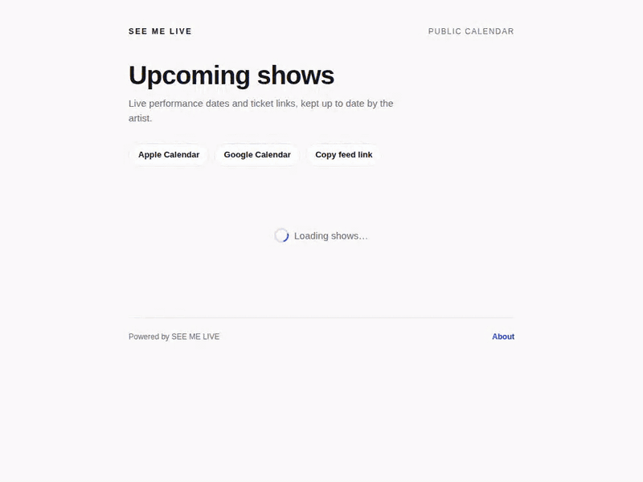
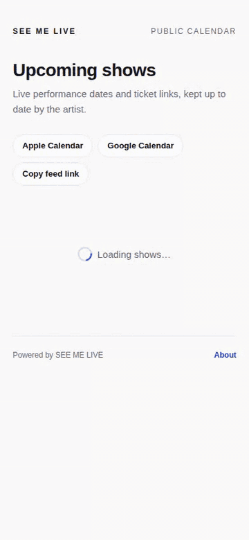
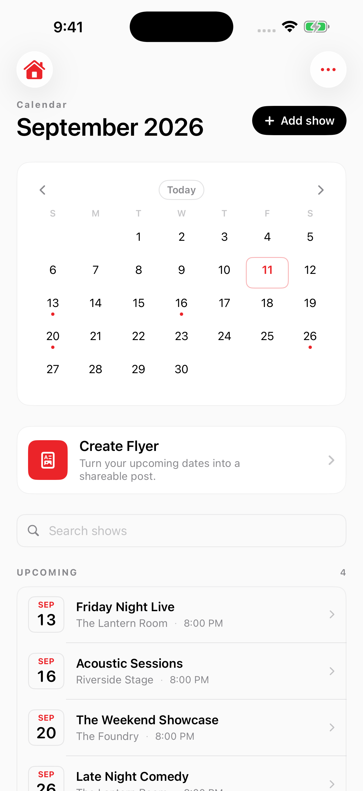
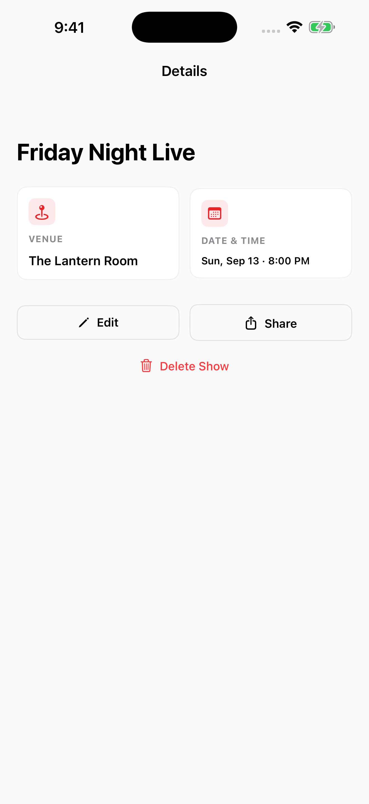
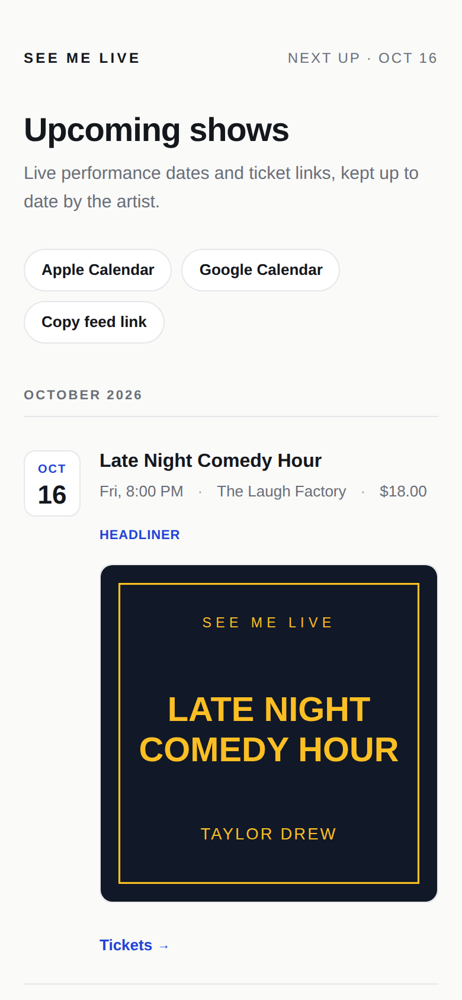
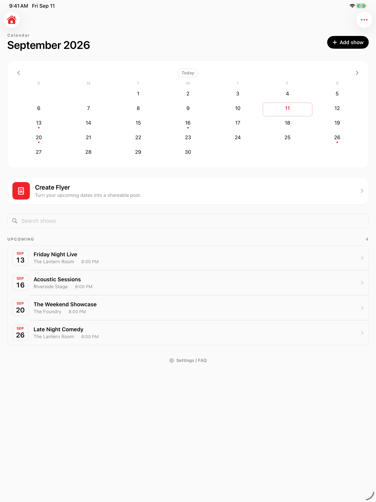
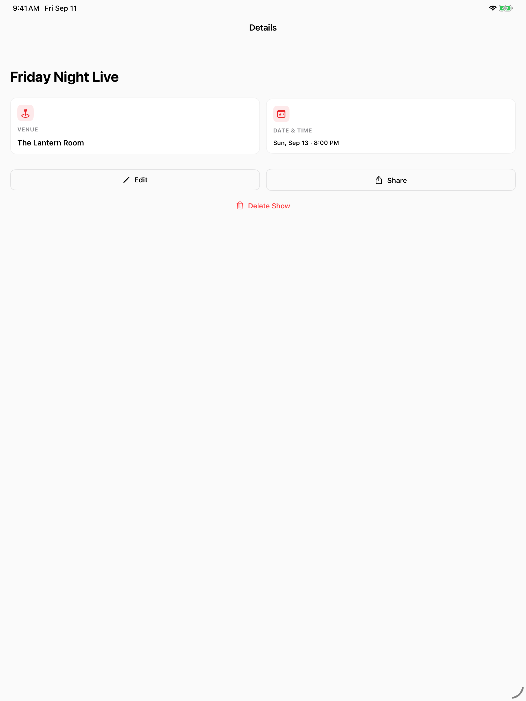
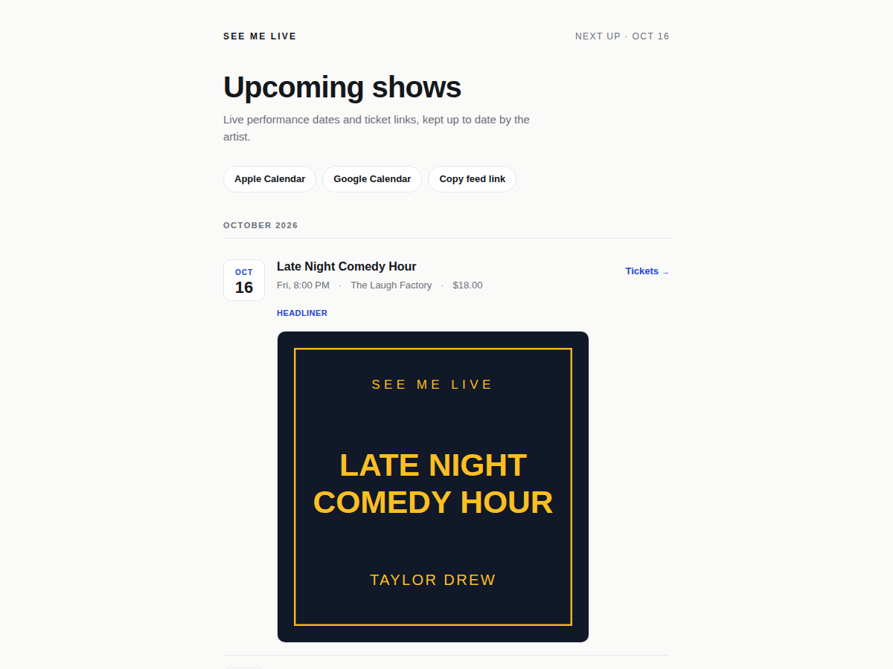
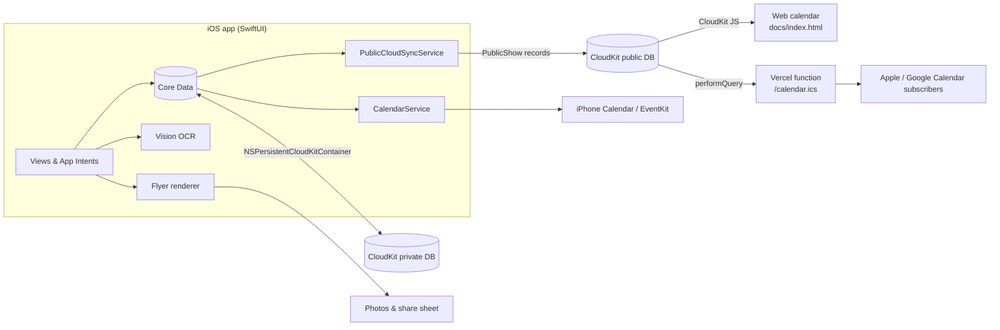

<div align="center">
  
  <h1>My Gig Calendar</h1>
  <p><strong>A native iOS calendar for live performers: enter a show once and it reaches your devices, your fans' calendars, and your socials.</strong></p>

  [](https://swift.org)
  [](https://developer.apple.com/ios/)
  [](https://github.com/taylordrew4u2/MyGigCalendar/actions/workflows/ios.yml)
  [](https://apps.apple.com/us/app/my-gig-calendar/id6760590068)

  <p>
    <a href="https://apps.apple.com/us/app/my-gig-calendar/id6760590068"><strong>Download on the App Store</strong></a>
    &nbsp;·&nbsp;
    <a href="docs/ARCHITECTURE.md">Architecture notes</a>
  </p>
</div>

<div align="center">
  
  &nbsp;
  
  <p><sub><b>The fan-facing web calendar</b> (not the iOS app): shows grouped by month, a show's flyer, and the subscribable feed link. Recorded with sample shows in place of a performer's live CloudKit data. App screenshots are <a href="#screenshots">below</a>.</sub></p>
</div>

## Why I built it

Performers keep their schedule in one place and then re-type it everywhere else: a personal calendar, a public "upcoming shows" page, and a promo graphic for each social platform. My Gig Calendar makes the show record the single source of truth. Private data syncs through iCloud, a reduced public copy feeds a web calendar and `.ics` subscription, and the same record drives a flyer generator.

## Highlights

- **Two CloudKit databases, two jobs.** Core Data syncs the full record privately via `NSPersistentCloudKitContainer`; `PublicCloudSyncService` mirrors a deliberately reduced `PublicShow` record (title, venue, date, owner ID) to the public database, so notes, prices, and photos never leave the performer's private store.
- **Offline-first public sync.** Failed publishes set `needsPublicSync` in Core Data, failed deletes are queued in `UserDefaults`, and both are retried on launch and on return to foreground, so adding a gig backstage with no signal still works.
- **Idempotent calendar output.** The `EKEvent` identifier is stored on each show so edits update the same iPhone Calendar event; the `.ics` feed uses CloudKit record names as stable `UID`s, so subscribers see updates, not duplicates.
- **On-device flyer import.** Vision `VNRecognizeTextRequest` plus `NSDataDetector` date parsing and venue heuristics turn a photo of a poster into a prefilled show form.
- **Native media pipeline.** Flyers render at exact platform sizes (1080×1920, 1080×1080, 1600×900, 1200×628, 1200×630); video backgrounds are composited with `AVMutableVideoComposition`.
- **Almost no backend.** The web calendar is a static page that reads CloudKit directly with CloudKit JS; the only server code is one Vercel function that emits the RFC 5545 feed. No third-party Swift dependencies.

## Features

| Area | What it does |
|------|--------------|
| **Show management** | Month calendar home screen, upcoming and past lists, search across title, venue, role, and notes. Shows carry venue, date, time, price, ticket link, role, notes, and a flyer photo. |
| **Flyer import** | Photograph a poster; on-device OCR prefills title, venue, and date. |
| **Siri & Shortcuts** | "Add a gig", "Open add gig", and "Show my gigs" via App Intents and an `AppShortcutsProvider`. |
| **Sync** | Private iCloud sync across iPhone and iPad; public CloudKit mirror with a retry queue. |
| **iPhone Calendar** | Optional event per show in a dedicated calendar, with an optional one-hour reminder. |
| **Flyer studio** | Six presets (IG Story, IG Post, TikTok, X/Twitter, Facebook, Link Preview); gradient, dark, light, or custom backgrounds (color, gradient, photo, video); draggable, rotatable text with font, weight, color, shadow, and outline. |
| **Purchases** | StoreKit 2 in-app purchase to remove the watermark. |
| **Web calendar** | Static page at `/?user=<ID>`: a performer's upcoming shows grouped by month; no account needed to view. |
| **Calendar feed** | `/calendar.ics?user=<ID>` with one-tap subscribe for Apple Calendar (`webcal://`) and Google Calendar. |

## Screenshots

<table>
  <tr>
    <td align="center"></td>
    <td align="center"></td>
    <td align="center"></td>
  </tr>
  <tr>
    <td align="center"><sub>iPhone: calendar home</sub></td>
    <td align="center"><sub>iPhone: gig details</sub></td>
    <td align="center"><sub>Web calendar on a phone</sub></td>
  </tr>
  <tr>
    <td align="center"></td>
    <td align="center"></td>
    <td align="center"></td>
  </tr>
  <tr>
    <td align="center"><sub>iPad: calendar home</sub></td>
    <td align="center"><sub>iPad: gig details</sub></td>
    <td align="center"><sub>Web calendar on desktop</sub></td>
  </tr>
</table>

## Architecture



**Design decisions**

- **Separate public record type instead of sharing the private zone.** The app writes only title, venue, date, and `userID` to `PublicShow` and explicitly clears the rest, so nothing added to the private model later becomes public by accident.
- **Anonymous UUID as identity.** A UUID created on first launch keys the performer's public records and URLs. No sign-up flow, and nothing personal in the link.
- **Persisted retry state, not an in-memory queue.** Unsynced shows are flagged in Core Data and pending deletes are stored in `UserDefaults`, so outstanding public work survives app termination and resumes on the next launch or foreground.
- **Static web page plus one function.** The calendar page talks to CloudKit from the browser; only the `.ics` feed needs a server, because calendar clients can't run JavaScript. The response is cached for an hour (`Cache-Control: max-age=3600`).
- **Apple frameworks only.** Vision, EventKit, AVFoundation, StoreKit 2, and App Intents cover every feature without a dependency manager.

Service-by-service notes, the 18-attribute Core Data model, and the public CloudKit schema are in [`docs/ARCHITECTURE.md`](docs/ARCHITECTURE.md).

## Tech stack

| Layer | Technology |
|-------|-----------|
| App | Swift 5, SwiftUI, iOS 17+ (iPhone and iPad) |
| Persistence & private sync | Core Data, `NSPersistentCloudKitContainer` |
| Public data | CloudKit public database |
| System integration | EventKit, App Intents, PhotosUI |
| Text recognition | Vision, `NSDataDetector` |
| Rendering | `UIGraphicsImageRenderer`, AVFoundation |
| Purchases | StoreKit 2 |
| Web calendar | Static HTML/CSS/JS, CloudKit JS |
| Calendar feed | Node.js serverless function on Vercel |
| CI | GitHub Actions on `macos-15` |

## Getting started

Requirements: Xcode 16 or later (project format 77), and an Apple Developer account for the iCloud capability.

```bash
git clone https://github.com/taylordrew4u2/MyGigCalendar.git
cd MyGigCalendar
open "SEE ME LIVE.xcodeproj"
```

Select the **SEE ME LIVE** scheme, pick a simulator or device, and press **Cmd+R**. CloudKit features need a signed-in iCloud account; the app checks availability at launch and turns sync off without one.

- **CloudKit:** create the `iCloud.comedy.SEE-ME-LIVE` container and the `PublicShow` record type. Walkthrough: [`CLOUDKIT_SETUP.md`](CLOUDKIT_SETUP.md).
- **Web calendar and feed:** `vercel.json` publishes `docs/` and routes `/calendar.ics` to the function. Run locally with `npx vercel dev`, then open `/?user=<USER_ID>` or `/calendar.ics?user=<USER_ID>`. Details: [`CALENDAR_FEED_SETUP.md`](CALENDAR_FEED_SETUP.md).

## Testing

100 XCTest cases in 9 files cover persistence, the show editor's save logic, flyer rendering, HTML export, OCR parsing, user identity, and StoreKit purchases (against a local `.storekit` configuration).

```bash
xcodebuild test \
  -project "SEE ME LIVE.xcodeproj" \
  -scheme "SEE ME LIVE" \
  -destination "platform=iOS Simulator,name=iPhone 16,OS=latest"
```

CI runs this on every push and pull request to `main`, skipping the one purchase test that needs a window scene to present the StoreKit sheet. A second, manually triggered workflow boots a Simulator and drives the main flows with `idb` ([`Tools/simulator-run/drive.py`](Tools/simulator-run/drive.py)), saving screenshots.

## Project structure

```
SEE ME LIVE/            SwiftUI views, services, Core Data model, App Intents
SEE ME LIVETests/       XCTest suite and StoreKit test configuration
docs/                   Web calendar (index.html), .ics function, ARCHITECTURE.md
AppStore/               App Store icons and screenshots
Tools/simulator-run/    Simulator automation script
.github/workflows/      CI build/test and on-demand Simulator run
screenshots/            README media
```

---

<p align="center">Built by Taylor Drew · <a href="https://github.com/taylordrew4u2">github.com/taylordrew4u2</a></p>
